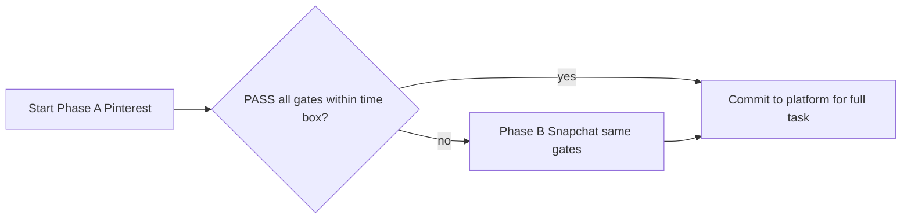

# Experiment commitment: Pinterest vs Snapchat (data-access probe)

This document locks **what “pass” means**, **when to pivot**, and **what artifacts to keep** for the Ravineo hiring-task platform choice. It is meant to prevent endless exploration and to make the decision auditable.

**Related context:** [PLATFORM_CHATGPT.md](../PLATFORM_CHATGPT.md) (background, company notes, prior comparison). **Initial research closed:** [INITIAL_RESEARCH.md](INITIAL_RESEARCH.md).

### Experiment order (planned vs what happened)

| | |
| --- | --- |
| **Planned** | **Phase A = Pinterest first**, then **Phase B = Snapchat** only if A fails the gates or time box ([§1](#1-context) strategy table). |
| **What we did first in practice** | Snap was probed early in the agent session because the **public Ads Library** returned **real JSON immediately** (`sponsored_content`), while Pinterest’s repo is **web-first** and had no quick machine export in that pass. That was an **execution shortcut**, not a change to the commitment. |
| **Research closure** | **Done** — see [`docs/INITIAL_RESEARCH.md`](INITIAL_RESEARCH.md). Pinterest Phase A = **FAIL** for official public API path; Snap = primary evidence base. |

---

## 1. Context

**Hiring brief (summary):** Map data sources (ads libraries, APIs, transparency tools); pull **real** sample data—not mockups—document access paths and limits (rate limits, coverage, granularity); propose analytics Ravineo could offer to large B2C brands; sketch a UI that shows what the data can support.

**Decision strategy:**

| Phase | Platform        | When                                               |
| ----- | --------------- | -------------------------------------------------- |
| **A** | Pinterest first | Start here                                         |
| **B** | Snapchat        | If Phase A **fails** gates or **time box** expires |

Phase B uses the **same** pass criteria as Phase A so the comparison is fair (only the platform changes).

---

## 2. Non-goals (scope creep)

- No polished product UI during this experiment.
- No requirement to fully cover **influencer/creator**, **organic**, or **fraud/public opinion** in the pass gates—only **enough signal** that continuing on that platform for the full assignment is justified.
- No “perfect” EU coverage; document gaps honestly.

---

## 3. Time box (commitment)

| Phase                   | Default duration                                | Notes                                                                                                                            |
| ----------------------- | ----------------------------------------------- | -------------------------------------------------------------------------------------------------------------------------------- |
| **Phase A (Pinterest)** | **2 hours** hard stop                           | Clock starts when you begin intentional data-access work (not reading background). At stop: evaluate PASS/FAIL and decide pivot. |
| **Phase B (Snapchat)**  | Same criteria; **fresh** 2-hour box recommended | Start immediately after Phase A fail.                                                                                            |

**Optional 1-hour sprint variant:** If you explicitly enable it (you are time-starved), use the reduced bar in [§4 Optional sprint](#optional-1-hour-sprint-variant). Still use a hard stop at 60 minutes.

**Optional parallel probe:** Up to **30 minutes** skimming Snapchat Ads Gallery docs *while* Phase A runs does **not** extend the Phase A clock. Do not count that toward Pinterest pass/fail.

---

## 4. Success criteria (PASS for a platform)

**PASS** only if **all** gates below are met within the active phase time box.

| Gate                  | Definition                                                                                                                                                                                                                               |
| --------------------- | ---------------------------------------------------------------------------------------------------------------------------------------------------------------------------------------------------------------------------------------- |
| **Real data**         | At least **50** distinct ad records (or platform-equivalent transparency records) with **EU** delivery or clearly EU-labeled scope. Not synthetic/mock.                                                                                  |
| **Minimum fields**    | Each record includes or is joinable to: **advertiser name or ID**, **time or delivery window**, **creative reference** (URL, media ID, or hash). If the source exposes targeting/geo/region, capture it or document **N/A** with reason. |
| **Reproducibility**   | Another person could repeat ingestion using **documented** steps: script names, commands, env vars, or exact URLs and parameters. “Clicked until it worked” without capture = **FAIL**.                                                  |
| **Legitimacy**        | Path is **official API**, **official transparency repository/export**, or **documented third-party** with a short ToS note. **Scraping:** allowed only if **explicitly labeled**, with robots/ToS risk called out.                       |
| **Limits documented** | Short written list: rate limits, history depth, auth requirements, coverage gaps, and what you **did not** obtain (e.g. full organic feed, creator graph).                                                                               |

### Optional 1-hour sprint variant

Use **only** if you declare **Sprint mode** at Phase start (write it in the [Results appendix](#8-results-appendix-template)).

| Gate                                    | Sprint definition                                                                                        |
| --------------------------------------- | -------------------------------------------------------------------------------------------------------- |
| **Real data**                           | At least **20** records (same EU/real-data rules).                                                       |
| **Minimum fields**                      | **Advertiser ID or name** + **one creative identifier** + **date** (delivery or fetch date—state which). |
| **Reproducibility, Legitimacy, Limits** | Same as full criteria.                                                                                   |

---

## 5. Failure criteria (FAIL → pivot)

Phase A **fails** if **any** of:

1. Time box expires without meeting **PASS** (full or sprint, whichever you declared).
2. Data depends on **fragile** scraping (no stable contract/API) and you cannot reproduce within the box.
3. You can only access **your own** authenticated ads/analytics with **no** defensible path to **competitor** or **repository-scale** transparency data (the assignment is competitive/transparency intelligence, not “my account dashboard”).

On FAIL: **pivot to Phase B (Snapchat)** with the same gates (unless you already have a PASS on Pinterest—then stop and commit to Pinterest).

---

## 6. Alignment check (Ravineo rubric)

**Not all rows need to be “covered” to PASS** §4. After you have a candidate PASS, fill this honestly for the **chosen** platform.

| Area                                        | Status (Snapchat — chosen) | Notes |
| ------------------------------------------- | ---------------------------- | ----- |
| **Ad transparency** (libraries, EU ads)     | **partial** → **covered** for pipeline | Paid DE sample + API; scale with throttling |
| **Influencer / creator activity**           | **partial**                  | `sponsored_content` + creator search endpoint |
| **Organic presence**                        | **partial**                  | Organic **commercial** feed, not full UGC |
| **Fraud / opinion / scam-relevant signals** | **partial**                  | Ad metadata + targeting; needs product rules |

Use **partial** when the sample or API gives a plausible path but not a full story in the experiment window.

**Detail:** [§6 Alignment (Snap — after this run)](#6-alignment-snap--after-this-run) below matches this summary.

---

## 7. Artifacts to produce on PASS

On **PASS** for the platform you commit to:

1. **Sample files** under `data/samples/` with a **timestamp** in the filename or folder (e.g. `data/samples/2026-04-07-pinterest/`).
2. **Limits + reproduction** either in `[notes/limits.md](../notes/limits.md)` **or** in [§8 Results appendix](#8-results-appendix-template) below (commands, URLs, env vars).
3. **One short paragraph:** why this platform wins the remaining **2–3 days** of the assignment (tractability + link to Ravineo client value).

### Why Snapchat for the remaining 2–3 days (draft)

Snap’s **public** Ads Gallery endpoints let you pull **real JSON** without OAuth, prove **reproducible** ingestion (`curl` + pagination script), and split the story into **paid EU ads** (`POST .../ads_library/ads/search` + `countries`) vs **live commercial/creator surfaces** (`sponsored_content`). That maps cleanly to Ravineo’s pillars: **competitive ad visibility**, **creator/commercial presence**, and a path to **fraud/transparency** narratives once ad rows are available. **Your** machine should run **sparse** `ads/search` calls (see `[notes/limits.md](../notes/limits.md)`) to avoid `E1009` rate limits seen on shared IPs.

---

## 8. Results appendix (template)

Fill this during/after the run.

### Phase A — Pinterest

| Field              | Value                                                                                                |
| ------------------ | ---------------------------------------------------------------------------------------------------- |
| Mode               | Phase A doc run — no in-repo JSON sample yet                                                         |
| Start time (local) | —                                                                                                    |
| End time (local)   | —                                                                                                    |
| PASS / FAIL        | **FAIL** (official **documented** API path for competitor EU ads) — see [`pinterest-phase-a.md`](pinterest-phase-a.md) conclusion + [`INITIAL_RESEARCH.md`](INITIAL_RESEARCH.md) §4 |
| Sample path(s)     | —                                                                                                    |
| Data path type     | **Advertiser OAuth APIs** only in v5 OpenAPI; repository = **SPA** / DevTools / third-party          |
| If FAIL: reason    | No public `curl`-documented Ads Repository API like Snap; pivot to Snap for assignment              |

### Phase B — Snapchat (if run)

| Field              | Value                                                                                                                                                                                                                                                            |
| ------------------ | ---------------------------------------------------------------------------------------------------------------------------------------------------------------------------------------------------------------------------------------------------------------- |
| Mode               | full (target 50+ records)                                                                                                                                                                                                                                        |
| Start time (local) | 2026-04-07 (agent retry)                                                                                                                                                                                                                                         |
| End time (local)   | same session                                                                                                                                                                                                                                                     |
| PASS / FAIL        | **Strong partial** — **EU paid ads proven:** `POST .../ads/search` returned **10** DE Spotify ads (`impressions_map.de`, targeting, creatives) → [`ads_search_spotify_de_retry.json`](../data/samples/2026-04-07-snap-sponsored-content/ads_search_spotify_de_retry.json). **§4 “50+” paid EU rows:** add pagination / more brands with **long gaps** — bursts hit **429 / E1009**. **Commercial:** **400+** rows → [`sponsored_content_pages_1_2.json`](../data/samples/2026-04-07-snap-sponsored-content/sponsored_content_pages_1_2.json). |
| Sample path(s)     | Paid EU: `ads_search_spotify_de_retry.json`. Commercial: `sponsored_content_page1.json`, `sponsored_content_pages_1_2.json` |
| Data path type     | **Official API**, no OAuth — `POST .../ads/search`, `GET .../sponsored_content`, [`scripts/paginate_snap_sponsored_content.py`](../scripts/paginate_snap_sponsored_content.py) |
| If FAIL: reason    | Heavy bursts → **429 / E1009**; space calls; proxies optional; [`notes/limits.md`](../notes/limits.md) |

### Decision

| Field                  | Value                                                                      |
| ---------------------- | -------------------------------------------------------------------------- |
| **Committed platform** | **Snapchat** for tractable prototype (pending your Pinterest Phase A pass) |
| **Pivot used?**        | **No formal pivot** — Snap smoke-tested first; **Pinterest Phase A** still owed per [Experiment order](#experiment-order-planned-vs-what-happened) |
| **Rubric matrix (§6)** | See **§6 filled** below                                                    |

### §6 Alignment (Snap — after this run)

| Area                                        | Status                         | Notes                                                                                                                            |
| ------------------------------------------- | ------------------------------ | -------------------------------------------------------------------------------------------------------------------------------- |
| **Ad transparency** (libraries, EU ads)     | **partial** (DE paid ads **sampled**) | Real `POST .../ads/search` JSON with `impressions_map.de`; scale with throttling / proxies |
| **Influencer / creator activity**           | **partial**                    | `sponsored_content` + `POST .../sponsored_content/search` with `creator_name` (docs)                                             |
| **Organic presence**                        | **partial**                    | `GET .../sponsored_content` = live organic **commercial** content                                                                |
| **Fraud / opinion / scam-relevant signals** | **out of scope for prototype** | Needs ad-level + cross-signal work; DSA narrative still available                                                                |

### Optional links

- Commit SHA(s):
- PR / branch:
- Repro: [`scripts/fetch_snap_ads_library_sample.sh`](../scripts/fetch_snap_ads_library_sample.sh), [`scripts/paginate_snap_sponsored_content.py`](../scripts/paginate_snap_sponsored_content.py), [`scripts/snap_ads_search_page2.sh`](../scripts/snap_ads_search_page2.sh) (+ [`ads_search_spotify_de_body.json`](../data/samples/2026-04-07-snap-sponsored-content/ads_search_spotify_de_body.json))
- Limits: [`notes/limits.md`](../notes/limits.md)
- Pinterest Phase A: [`docs/pinterest-phase-a.md`](pinterest-phase-a.md)

### Next steps (implementation — research done)

1. **Read** [`INITIAL_RESEARCH.md`](INITIAL_RESEARCH.md) — platform choice + brief checklist + submission paragraph.
2. **Build UI** prototype (table + filters + one chart) using existing JSON; optional: fetch **≥50** paid EU rows on your network (spacing / proxies).
3. **Czech/English write-up** for Ravineo using §9 template in `INITIAL_RESEARCH.md`.

---

## Flow (reference)

